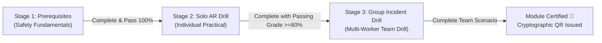

# SafeAR — Mobile Web App & Dashboard Requirements Specification

**Document Version:** 1.0.0  
**Project:** SafeAR — AR-Based Mining Industrial Safety Training & Certification Platform  
**Target Platform:** Mobile-First Web Application & Capacitor Hybrid App (Optimized for Android 10+ Tablets & Smartphones)

---

## 1. Executive Summary & Scope

SafeAR is an industrial-grade safety training platform designed specifically for underground and opencast mine workers and safety supervisors in India. 

The objective of this specification is to define the mobile web application interface and user experience, decoupling the user navigation shell from the underlying 3D AR rendering engines. The mobile web experience comprises:
1. **Universal Authentication Screen:** A branded login window featuring the SafeAR logo and design, providing access paths for two distinct user personas: **Safety Supervisor** and **Mine Worker**.
2. **Supervisor Compliance Dashboard:** A mobile-optimized administrative command center where supervisors monitor workers under their shift/section, viewing individual test scores, certification status, module mastery, and critical compliance flags.
3. **Worker Safety Training Hub:** A modular training matrix featuring **six core mining hazard modules**.
4. **Three-Stage Progressive Unlock Pipeline:** A strict pedagogical progression model for every module:
   - **Stage 1: Prerequisites** (Theory, hazard signs, PPE verification)
   - **Stage 2: Solo AR Practical Drill** (Individual simulated tactical execution)
   - **Stage 3: Collaborative Incident Drill** (Multi-worker team emergency response coordination)

---

## 2. User Personas

| Persona | Role in Mine | Key Needs on Mobile Web |
|---|---|---|
| **Ramesh Mahato** (Worker) | Underground Face Operator / Loader | High-contrast visual UI, step-by-step guided unlock, audio cues in local languages, clear progression status, tactile buttons. |
| **Vikram Singh** (Supervisor) | Safety Overman / Shift Incharge | Fast roster overview, worker readiness check before entering shaft, certification expiry alerts, drill performance metrics. |

---

## 3. Functional Requirements

### 3.1 Authentication & Role Routing (`FR-AUTH`)

- **FR-AUTH-01: Branded Login Interface:**
  - Must prominently display the official **SafeAR Logo** (`/dashboard/img/logo.png`), application title, and mining safety badge.
  - Clean card/window elevation with industrial high-contrast dark theme (charcoal, high-visibility amber `#f59e0b`, neon cyan `#00e5ff`).
  - Inputs for Worker/Supervisor ID and PIN/Password.
  - Role switcher tab or dedicated action buttons: **"Worker Portal"** vs **"Supervisor / Admin Portal"**.
  - Demo quick-fill personas for fast evaluation without typing credentials.

- **FR-AUTH-02: Role-Based Routing & Session State:**
  - **Supervisor Login:** Redirects to `/dashboard/mobile/supervisor` (Supervisor Command Center).
  - **Worker Login:** Redirects to `/dashboard/mobile/worker` (Training Hub).
  - Session state maintained in `sessionStorage` with graceful logout and role switching.

---

### 3.2 Supervisor Admin Dashboard (`FR-SUP`)

- **FR-SUP-01: Shift & Section Overview:**
  - Displays supervisor profile (Name, Mine Code, Assigned Shift, Total Subordinates).
  - Quick KPI summary cards:
    - Overall Team Compliance Rate (%)
    - Certified Active Workers
    - Workers Requiring Recertification
    - Critical Hazard Deficiencies Identified
- **FR-SUP-02: Worker Roster & Performance Matrix:**
  - Searchable list of workers assigned directly under the logged-in supervisor.
  - For each worker:
    - Worker Name, ID, Designation, and Shift Section.
    - Overall readiness rating (e.g., 94% — Certified).
    - Status badges: `Certified`, `In Training`, `Expired`, `High Risk`.
    - Expandable module score breakdown across all 6 mining hazard domains.
    - Last active timestamp and date of recertification due.
- **FR-SUP-03: Drill Assignment & Verification Action:**
  - Quick action to assign mandatory refresher drills to deficient workers.
  - One-tap verification of digital cryptographic certificates.

---

### 3.3 Worker Training Hub (`FR-WRK`)

- **FR-WRK-01: 6 Mining Hazard Modules:**
  The training hub must feature six critical mining safety modules:
  1. **🔥 Fire & Explosion Response (`fire-response`):**
     - Underground coal dust and methane fire containment, PASS extinguisher operation, ventilation airway retreat.
  2. **☣️ Gas Leak & Toxic Atmosphere (`gas-leak`):**
     - Detection of Methane (CH4), Carbon Monoxide (CO), Hydrogen Sulfide (H2S); multi-gas detector calibration; oxygen self-rescuer (SCSR) donning.
  3. **🪨 Roof Fall & Strata Control (`strata-hazard`):**
     - Strata sounding (tapping test), geological crack observation, rock bolt torque inspection, tell-tale monitoring, withdrawal protocol.
  4. **🌊 Underground Inundation & Flooding (`inundation-hazard`):**
     - Water barrier integrity, signs of old working breakthroughs, dam water level alarms, high-ground escape routing.
  5. **🚜 Haulage, Dumpers & Machinery Safety (`machinery-hazard`):**
     - Heavy earth moving machinery (HEMM) blind spots, conveyor pull-cord emergency trip switches, Lockout-Tagout (LOTO) isolation, pinch-point hazards.
  6. **⚡ Electrical Hazards & Blasting Protocol (`blasting-hazard`):**
     - Flameproof enclosure inspection, explosive magazine handling, pre-blasting siren clearance, blast shelter protocol, toxic fume wait times.

- **FR-WRK-02: Module Card Presentation:**
  - Each module displays:
    - High-visibility hazard iconography and thematic color accent.
    - Module name (with multilingual subtitles in Hindi / English).
    - Overall module status (`Locked`, `Ready`, `In Progress`, `Certified`).
    - Progress ring or bar reflecting 3-stage completion (0%, 33%, 66%, 100%).

---

### 3.4 Three-Stage Progressive Unlock Pipeline (`FR-STG`)

Each module enforces a sequential, non-bypassable pedagogical pipeline:

#### Stage 1: Prerequisites (`stage-prereq`)
- **Status:** Unlocked by default when starting a new module.
- **Content:**
  - Hazard Briefing: Audio/visual explanation of the hazard in plain industrial language.
  - PPE Compliance Checklist: Worker taps and verifies mandatory PPE required for this hazard (e.g., Flameproof boots, self-rescuer, multi-gas detector, leather gloves).
  - Hazard Identification Quick-Check: 2–3 visual situation cards where the worker taps the correct safe action.
- **Unlock Rule:** Completing the checklist and verification marks Stage 1 complete and immediately unlocks Stage 2.

#### Stage 2: Solo AR Practical Drill (`stage-solo-ar`)
- **Status:** Locked until Stage 1 is marked `Completed`.
- **Content:**
  - Individual simulation screen representing the hands-on AR execution.
  - Interactive drill sandbox preview:
    - Live target reticle and aim/dwell HUD.
    - Timing & accuracy scoring metric.
    - Error feedback (e.g., incorrect nozzle distance, sweeping too fast).
- **Unlock Rule:** Achieving the requisite drill score (>= 80%) unlocks Stage 3.

#### Stage 3: Collaborative Group Incident Drill (`stage-group-drill`)
- **Status:** Locked until Stage 2 is marked `Completed`.
- **Content:**
  - Multi-worker emergency team coordination scenario.
  - Role Assignment: Worker picks their assigned role in the emergency crew:
    - *Role A (First Responder):* Brings extinguisher / emergency isolation tool.
    - *Role B (Scout / Evacuation Leader):* Checks airway ventilation direction and clears primary exit route.
    - *Role C (Comms & Alert):* Triggers mine-wide acoustic alarm, contacts pithead control room, and closes emergency isolation stopcocks.
  - Interactive incident decision tree where the team must coordinate simultaneous actions to contain the catastrophe without casualties.
- **Completion & Certification:**
  - Successful resolution generates completion certificate with verifiable score and QR badge.

---

## 4. Non-Functional & UI/UX Requirements

- **NFR-01: Apple Fluid Design & Industrial Ergonomics:**
  - Spring-driven animations, tactile active states (`transform: scale(0.97)` on press).
  - Responsive cards with glassmorphic depth (`backdrop-filter: blur(12px)`).
  - High contrast ratio (WCAG AAA compliant) readable in dim underground illumination or bright open-cast sunlight.
- **NFR-02: Zero Network Resiliency:**
  - All navigation, data caching, progress state, and interactive simulations must operate 100% offline within the client browser/PWA.
  - Progress persists to `localStorage`.
- **NFR-03: Responsive Screen Adaptability:**
  - Pixel-perfect layout from 360px mobile viewports (smartphones) up to 1024px+ tablets (Samsung Galaxy Tab A8 / industrial rugged tablets used by mining staff).

---

## 5. Acceptance Criteria

1. Branded login modal opens seamlessly with SafeAR logo, name, and role selector.
2. Supervisor login shows all assigned workers with live compliance ratings and score breakdowns.
3. Worker login displays the 6 core mining safety modules with visual progress rings.
4. Clicking any module opens the 3-stage modal:
   - Stage 1 is playable immediately.
   - Stage 2 is locked with a padlock icon until Stage 1 is completed.
   - Stage 3 is locked until Stage 2 is completed.
5. Completing Stage 1 enables Stage 2; completing Stage 2 enables Stage 3.
6. Responsive on mobile devices, clean aesthetic, and zero broken assets.
